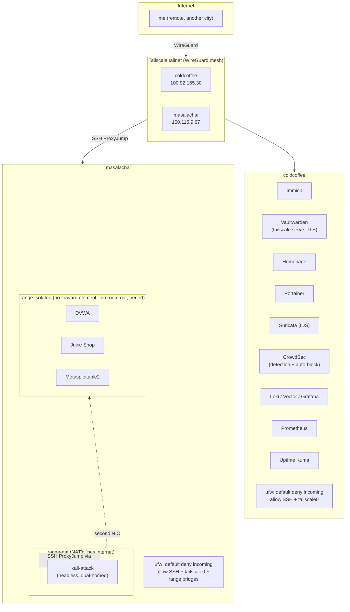

# Architecture

## Why this exists

A personal cybersecurity homelab built to be dual-purpose: a real training range for OSCP-style
offensive practice, and a working blue-team stack (detection, log aggregation, observability)
run against my own production services. Everything here is managed entirely remotely over
Tailscale — no physical access to either machine during the build — and everything is
Ansible/Compose-defined so the whole thing is reproducible from a clean OS install.

**Threat model for the pentest range specifically:** solo operator. I am the only one attacking
it, for personal skill-building, not shared research. That decision shaped the network design
below — the range doesn't need to defend against anyone but a determined me.

## Hardware

| Host | CPU | RAM | Disk | GPU | Role |
|---|---|---|---|---|---|
| `coldcoffee` | i5-8265U (4c/8t) | 8GB | ~930GB | Intel UHD 620 | Personal services + blue-team stack |
| `masalachai` | i3-3217U (2c/4t) | 3.7GB | 465GB (100GB allocated) | NVIDIA GT 740M (CUDA) | Isolated pentest range |

Both run Ubuntu Server 24.04 LTS, joined to the same Tailscale tailnet. A third laptop (16GB
RAM) is planned to take over SIEM-class workloads once available — this build is deliberately
scoped and phased to fit what exists today rather than assuming hardware that isn't here yet.

## Network topology



Key properties, enforced at more than one layer so a single misconfiguration doesn't break
isolation:

- **`range-isolated` has no `<forward>` element in its libvirt network XML at all.** There is no
  NAT, no route, no path out — not "blocked by a firewall rule" but "the road doesn't exist."
  Verified directly against `iptables -L` (no FORWARD/NAT rules reference `virbr-riso`), not just
  by reading the XML.
- Vulnerable targets are reachable **only** from the Kali box's second NIC, which lives on that
  same isolated segment. They are unreachable from `coldcoffee`, from the raw LAN, and from the
  public internet — confirmed by testing from each vantage point, not assumed.
- `range-nat` (Kali's internet access, for tool updates) is a separate segment from
  `range-isolated`, so giving Kali internet access never implies giving targets internet access.
- Every host's `ufw` defaults to deny-incoming; the only inbound paths are SSH (as a safety net
  against total Tailscale lockout), the `tailscale0` interface, and — on `masalachai` only — the
  two range bridges needed for DHCP/DNS to guest VMs and the range's own NAT.
- Access to the range from the outside is always: Tailscale → SSH to `masalachai` → SSH
  ProxyJump to `kali-attack`. Neither range network is bridged to Tailscale or the LAN.

## Design decisions

**Hybrid virtualization for the range.** Web-app targets (DVWA, Juice Shop) run as Docker
containers on a macvlan network bound to the isolated bridge — full L2 peers on
`192.168.101.0/24` with no extra VM overhead. OS-level exploitation/privesc targets
(Metasploitable2, eventually Windows/AD boxes) run as full KVM VMs, since privilege escalation
practice needs a real kernel and real service surface, not a container. This gets the resource
efficiency of containers where it doesn't cost realism, and full VMs where it matters.

**Scaled-down detection stack instead of a full SIEM.** Wazuh's indexer alone wants 4GB+;
Security Onion wants 16GB+. Neither fits either box today. Suricata (network IDS, detection
only) → CrowdSec (behavioral analysis + the actual response/blocking layer, via its iptables
bouncer) → Loki/Vector/Grafana (log storage and visualization) gets real detection and response
capability within an ~1GB footprint. The upgrade path is explicit, not improvised: a full
Wazuh/Security Onion deployment moves to the 16GB machine once it arrives, ingesting from both
existing boxes.

**Everything as Ansible, not shell history.** Every playbook in `ansible/playbooks/` is
idempotent — re-running any of them against an already-converged host reports zero changes. This
was verified in practice for the firewall rollout (see below) and is the standard the rest of
the build holds to: if it isn't reproducible from this repo against a blank OS install, it isn't
considered done.

## AI-driven tooling on the range (hexstrike-ai)

Claude Code (running on `arch`) drives the range's tools via
[hexstrike-ai](https://github.com/0x4m4/hexstrike-ai), an MCP server that
wraps nmap/sqlmap/gobuster/etc. as callable tools. Two pieces, on two
different machines, same split as the pattern used for the standalone Kali
desktop VM (see `dotfiles`'s "hexstrike-ai MCP server on the Kali VM"):

- **`hexstrike_server.py`** (the Flask backend that actually shells out to
  the tools) runs on **`kali-attack`**, cloned to `~/hexstrike-ai`, in a
  venv (`hexstrike-env`). It has to run there, not on `masalachai` — only
  `kali-attack`'s second NIC has a route to `range-isolated` where DVWA/
  Juice Shop/Metasploitable2 actually live. `HEXSTRIKE_HOST` isn't set (so
  it binds `127.0.0.1` only) since the only consumer is the SSH tunnel
  below, not the network.
- **`hexstrike_mcp.py`** (thin MCP↔HTTP client) runs on `arch`, in a
  separate clone/venv at `~/tools/hexstrike-ai`, registered with Claude
  Code as the user-scope MCP server `hexstrike-masalachai`, pointed at
  `http://localhost:8889`.

**Reaching `kali-attack:8888` from `arch` needs a two-hop relay, not a
single tunnel**, because of the same key-trust boundary as the "nested SSH"
bug below: `kali-attack` only trusts `coldcoffee`'s identity, and `arch`
doesn't hold that private key, so a single multi-hop `ssh -J` originating
from `arch` can authenticate to `masalachai` but not past it. The working
shape is two independently-authenticated legs, chained through a shared
port:

```
# Leg 1, run from coldcoffee (uses coldcoffee's own trusted key for the
# jump through masalachai to kali-attack):
ssh -fN -L 8889:localhost:8888 kali-attack

# Leg 2, run from arch (uses arch's already-normal access to coldcoffee):
ssh -fN -L 8889:localhost:8889 coldcoffee
```

After both legs, `http://localhost:8889` on `arch` reaches
`hexstrike_server.py` on `kali-attack`. Neither leg is a systemd service —
both are started manually per session (`pgrep -fa 'L 8889'` on each host to
check if a leg is already up before starting a duplicate). This is
deliberate: unlike the desktop Kali VM's hexstrike server (auto-starts with
that VM, since it's a personal low-stakes lab), leaving an offensive
tools API listening by default on the range's attacker box isn't something
to make automatic — `kali-attack` and the tunnel are both started
on-demand for a testing session, not left running.

## Real bugs found and fixed along the way

Documenting these because they were genuine issues, not because the debugging was interesting —
each one would have been a real gap (or a real lockout) if it had shipped silently.

**`ufw allow OpenSSH` inserted a DENY rule ahead of its own ALLOW rule (2026-08-09).** Rolling
out a baseline firewall on both hosts, `sudo ufw allow OpenSSH` — followed immediately by `ufw
default deny incoming` and `ufw enable` — produced a rule set where `DENY 22/tcp Anywhere`
appeared *before* `ALLOW IN 22/tcp (OpenSSH)`. iptables is first-match-wins, so this would have
silently blocked all SSH, including over Tailscale, on both remotely-managed boxes with no
physical access to recover from it. Caught by checking `iptables -L ufw-user-input`
directly rather than trusting `ufw status`'s summary framing, and fixed live before it could bite.
The fix was rebuilt as an idempotent Ansible playbook (`ufw-baseline.yml`) using the
`community.general.ufw` module instead of raw `ufw` CLI commands — which doesn't reproduce the
ordering bug — plus a verification task that fails the playbook run outright if that ordering
ever reappears.

**Kali's second NIC silently stayed down after first boot.** cloud-init only auto-configures a
VM's primary interface by default. Kali was deployed dual-homed (`range-nat` + `range-isolated`)
but only the first NIC came up — the box had internet but couldn't reach the targets it was
built to attack. Fixed by adding an explicit `network-config` to the cloud-init seed (both
interfaces DHCP) and patching the already-running box via netplan; the root cause fix lives in
`kali-attack-vm.yml` so future rebuilds don't hit it again.

**CrowdSec's local API collided with Vaultwarden on port 8080.** Both defaulted to
`127.0.0.1:8080`. Moved CrowdSec's LAPI to `8090` across its config, credentials file, and the
firewall bouncer's `api_url` — an easy thing to miss since both services started fine
individually and only failed when both were live at once.

**Grafana and Loki's official images run as non-root UIDs.** Bind-mounted host data directories
need to be `chown`'d to match (`472` for Grafana, `10001` for Loki) or both containers
crash-loop on startup with permission errors that don't obviously point at ownership.

**Loki's default ingestion rate limit was too conservative for Vector's initial backlog
replay.** Vector shipping the *entire* existing journald history on first run tripped Loki's
default `ingestion_rate_mb`/`burst_size`, silently dropping events during the initial catch-up.
Bumped both limits; steady-state ingestion afterward is well under either threshold.

**Nested SSH through a jump host silently fails auth, and the error is misleading.** Reaching
the range's private IPs from `coldcoffee` requires going through `masalachai`. Running
`ssh masalachai "ssh ... target"` (nested) fails because `ryzil` on `masalachai` has no SSH
private keys of its own — but the error is a generic "Permission denied (publickey)" that reads
like a problem on the *target* side. The fix is `ssh -J masalachai <target>` (ProxyJump) run
directly from `coldcoffee`, which correctly forwards the *local* identity through the jump host
instead of expecting the jump host to have its own key. Lost real time chasing a phantom
cloud-init bug before finding this — the boot process was fine the entire time.

**`kali-attack`'s `/tmp` is a small tmpfs, which silently breaks `pip install` for
anything with a large native build.** Installing hexstrike-ai's full
`requirements.txt` on `kali-attack` failed with `OSError(28, 'No space left
on device')` — misleading, since `df -h /` showed 12G free. The actual
constraint is `/tmp` (RAM-backed tmpfs, 735M, matching the VM's 1.4GB total
RAM) — pip stages wheel builds there, and `angr`'s build blew past it.
`angr`/`pwntools` turned out to be dead weight anyway: grepping
`hexstrike_server.py` showed both only appear inside f-string *templates*
the server writes out for generated exploit scripts, never as actual
top-level imports, so the server runs fine without them. Fixed by
installing from a trimmed `requirements.txt` (everything except
`pwntools`/`angr`/the `bcrypt` pin that existed only for pwntools
compatibility) rather than by changing `TMPDIR` or growing the tmpfs —
irrelevant for a range attacker box whose job is web-app testing, not
binary exploitation.

**Prometheus couldn't scrape coldcoffee's own node_exporter (2026-09-02).** `node_exporter` binds to the
host's `tailscale_ip` only (never `0.0.0.0`, per `node-exporter.yml`), which works fine for masalachai's
cross-host scrape over a real `tailscale0` hop - but Prometheus scrapes coldcoffee's own node_exporter from
inside a Docker container on the *same* host, so that traffic crosses the docker bridge instead, which `ufw`'s
baseline (SSH + `tailscale0` only) silently dropped. Confirmed via `up{instance="coldcoffee"}` == 0 in
Prometheus while masalachai's target was healthy. Fixed with a scoped `ufw-baseline.yml` rule (port 9100/tcp
only, from Docker's private bridge range) rather than opening the interface broadly.

**cAdvisor can't identify any container's storage layer under Docker 29's containerd-snapshotter backend.**
Tried adding cAdvisor (both v0.49.1 and v0.52.1) on both hosts for per-container CPU/mem metrics - every
container came back as `Failed to identify the read-write layer ID`, because `coldcoffee` runs Docker 29.7.2
with the newer containerd-snapshotter-backed `overlayfs` storage driver, and cAdvisor only knows the classic
`overlay2` graphdriver's layerdb layout. This is a genuine, current upstream incompatibility, not a config
mistake - reverted cleanly rather than ship a privileged container that reports nothing. Per-container live
stats are still visible directly in Portainer's own UI (it talks to the Docker API, not cgroups/layerdb).

**sshd here doesn't log `"Failed password"` - it logs `"Connection closed by <IP> port <N> [preauth]"`.**
Building a Grafana panel to count SSH failed-auth attempts, `|= "Failed password"` matched nothing even
though a real CrowdSec `ssh-bf` ban had just fired from that exact journalctl source. Checked the raw journal
directly (`journalctl _SYSTEMD_UNIT=ssh.service`) - this OpenSSH build never emits the classic string at all,
only `"Connection closed by ..."`/`"Connection closed by authenticating user ... [preauth]"`, which is what
CrowdSec's own sshd parser was already matching. Fixed the panel to filter on `"[preauth]"` instead.

## Public exposure policy

Not everything stays private. Two read-only, narrowly-scoped items are public via Cloudflare
Tunnel (outbound-only connector on `coldcoffee`, no inbound ports opened for it):

- **`grafana.pranavc.me`** — the base Grafana app, login-gated like normal. The one exception is
  a single dashboard (fleet CPU/mem/disk/uptime for both hosts) shared through Grafana's native
  public-dashboard feature, which mints a dedicated access-token URL for *that dashboard only* —
  not anonymous access to the instance. Nothing else in Grafana is reachable without logging in.
- **`status.pranavc.me`** — an Uptime Kuma status page.

Everything else (the detection stack's Grafana panels beyond that one dashboard, the pentest
range, Vaultwarden, Portainer, Immich) stays Tailscale-only, permanently. Adding public surface
area is a deliberate choice made per service — a specific dashboard, not a whole app — not a
default.

## Roadmap

- [x] Cloudflare Tunnel + selective public dashboard
- [ ] Windows/AD lab (deferred to the 16GB machine — a domain controller alone wants 4GB+)
- [ ] Full SIEM (Wazuh or Security Onion) on the 16GB machine once available, ingesting from
      both existing hosts
- [ ] hashcat/GPU-cracking workflow using masalachai's GT 740M
